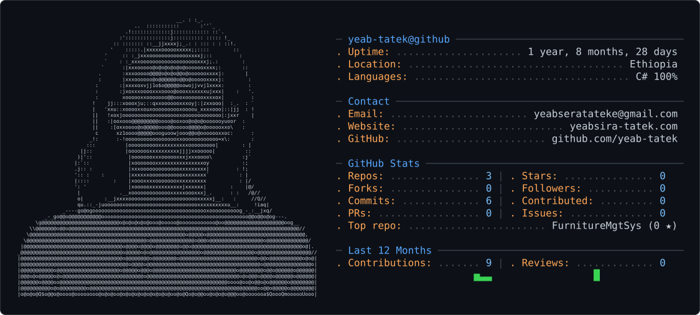

<picture>
  <source media="(prefers-color-scheme: dark)" srcset="dark_mode.svg" />
  <source media="(prefers-color-scheme: light)" srcset="light_mode.svg" />
  
</picture>
Hi there👋 

🌱I'm Yeabsira a Computer Science student currently architecting the bridge between dynamic user interfaces and data-driven insights.
My journey involves building scalable web applications while exploring the intersection of software engineering and Ai engineering.

🛠️ The Tech Stack I'm Scaling
- Frontend Core: Constructing responsive experiences with the modern JavaScript ecosystem.
- Frameworks: Leveraging Next.js and React for optimized, server-side rendered performance.
- Foundations: Deep-diving into the fundamental building blocks of the web (HTML5/CSS3).
- Data Science: Applying CS principles to extract value from complex datasets.

🚀 Current Focus
- 🏗️ Building full-stack projects that solve real-world problems.
- 🧪 Refining my analytical skills for a future in Data Science.
- 🎓 Exploring advanced algorithms and system design.

Fun fact:

-I have two dogs
-I don't like coffee
-Hobbies: Drawing, writing poetry, listening to music, and reading.

Turning caffeine into code and raw data into decisions.
